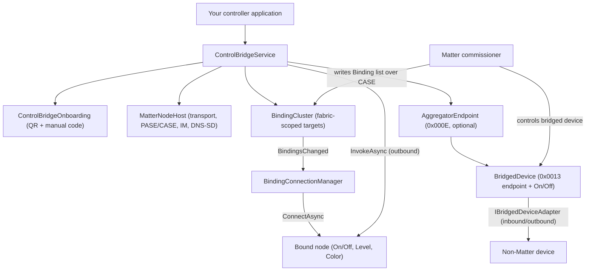
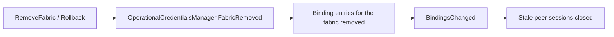

# RIoT2.Matter.ControlBridge

A **class library** that wraps a Matter **Control Bridge** (device type `0x0840`) into a single,
controller-facing API, and optionally an **Aggregator** (device type `0x000E`) that exposes non-Matter
devices into the fabric as **bridged** endpoints (device type `0x0013`). Embed it in an actual
controller application to expose both roles from **one commissionable node**: the Control Bridge drives
other Matter nodes it is bound to (sending commands *out*), while the Aggregator lets a commissioner
discover and control your non-Matter devices as if they were native (receiving commands *in*). It
composes and hosts the device, generates the **onboarding QR code and manual pairing code** a
commissioner scans, and manages both bound targets and bridged devices. Built on
[`RIoT2.Matter`](../RIoT2.Matter/README.md) for **.NET 9**.

**At a glance**

- 🧩 One façade — `ControlBridgeService` — composes the device, hosts it, and exposes both the controller runtime and the bridged-device runtime.
- 📇 Generates the onboarding **QR (`MT:`) string** and the **11-digit manual pairing code** from one provisioning bundle.
- 🔒 The scanned passcode and the on-device SPAKE2+ verifier come from the same bundle, so they can never diverge.
- 🔁 A commissioner's **Binding** writes automatically open CASE sessions to the bound peers.
- 🎛️ Drive bound nodes with `InvokeAsync` (On/Off, Level Control, Color Control, …).
- 🌉 Expose non-Matter devices through the **Aggregator** with `AddBridgedDeviceAsync`; each appears as a bridged (`0x0013`) endpoint with its own On/Off (or other) clusters.
- 🔌 Bridged devices are **dynamic**: add or remove them at runtime, and toggle each one's `Reachable` state.
- 🧹 Removing a fabric purges its bindings and tears down its sessions automatically.

---

## Table of contents

- [What it does](#what-it-does)
- [Requirements](#requirements)
- [Install](#install)
- [Architecture](#architecture)
- [Quick start](#quick-start)
- [Onboarding: QR code & manual pairing code](#onboarding-qr-code--manual-pairing-code)
- [Driving bound targets](#driving-bound-targets)
- [Bridging non-Matter devices](#bridging-non-matter-devices)
- [Resolving operational peers](#resolving-operational-peers)
- [Example: a complete Program.cs](#example-a-complete-programcs)
- [Fabric lifecycle](#fabric-lifecycle)
- [Public API](#public-api)
- [Project layout](#project-layout)
- [Related](#related)

---

## What it does

The library turns the raw `RIoT2.Matter` building blocks (device composition, hosting, Secure Channel,
Interaction Model, DNS-SD) into a bridge you can start in a few lines. It plays two complementary roles
on a single node:

- **Control Bridge (`0x0840`) — outbound.** Once a commissioner adds the node to a fabric and writes its
  Binding list, the library opens operational sessions to the bound nodes and lets your controller code
  invoke commands on them (On/Off, Level Control, Color Control).
- **Aggregator (`0x000E`) — inbound.** Optionally, the library also exposes your non-Matter devices as
  bridged (`0x0013`) endpoints, each carrying the Bridged Device Basic Information cluster (identity +
  reachability) and its application clusters (e.g. On/Off). A commissioner reads and controls those
  bridged devices as if they were native; an adapter you supply mirrors the traffic to and from the real
  device.

The Aggregator role is **opt-in**: it is composed only when `ControlBridgeSettings.AggregatorEndpoint`
is set. When it is left unset, the service is a pure Control Bridge and behaves exactly as before.

## Requirements

- **.NET 9 SDK** or later. The project enables `ImplicitUsings` and `Nullable`, so the examples below
  omit common `using` directives and assume a nullable-aware context.
- An **IPv6-capable** network interface. Matter is IPv6-centric; the operational UDP port is **5540**.
- Device **attestation credentials** (DAC/PAI/CD + DAC signer). See
  [`DeviceAttestationCredentials`](../RIoT2.Matter/README.md) for how to supply them.

## Install

Reference the library from your controller application:

```xml
<ItemGroup>
  <ProjectReference Include="..\RIoT2\RIoT2.Matter.ControlBridge\RIoT2.Matter.ControlBridge.csproj" />
</ItemGroup>
```

The library itself references only `RIoT2.Matter`:

```xml
<ItemGroup>
  <ProjectReference Include="..\RIoT2.Matter\RIoT2.Matter.csproj" />
</ItemGroup>
```

> QR-code **rendering** (ASCII or image) is intentionally left to the consumer — the library returns the
> `MT:` onboarding string, and you render it however suits your host (e.g. with `QRCoder`).

## Architecture



## Quick start

Compose settings, create the service, start it, and present the onboarding codes:

```csharp
using RIoT2.Matter.Clusters;      // NetworkInterface, InterfaceType, DeviceAttestationCredentials
using RIoT2.Matter.ControlBridge;
using RIoT2.Matter.DataModel;     // VendorId
using RIoT2.Matter.Device;        // DeviceInformation

var settings = new ControlBridgeSettings
{
    // Fixed device facts backing Basic Information (and shared with DNS-SD advertising).
    Information = new DeviceInformation
    {
        VendorId = new VendorId(0xFFF1),      // CSA test vendor id
        ProductId = 0x8000,
        VendorName = "RIoT2",
        ProductName = "RIoT2 Control Bridge",
        SoftwareVersion = 1,
        SoftwareVersionString = "1.0.0",
        SerialNumber = "RIOT2-BRIDGE-0001",
    },

    // Pre-provisioned DAC/PAI/CD material and the DAC signer (minted by the vendor's attestation PKI).
    Attestation = attestation,                // see DeviceAttestationCredentials

    // The node's network interfaces reported by General Diagnostics.
    NetworkInterfaces =
    [
        new NetworkInterface { Name = "eth0", IsOperational = true, Type = InterfaceType.Ethernet },
    ],

    // The 12-bit setup discriminator; encoded into both onboarding codes and advertised over DNS-SD.
    Discriminator = 0x0F00,
};

// Create the service. A fresh passcode + matching SPAKE2+ verifier are provisioned automatically
// (supply settings.Provisioning to pin a known passcode across restarts).
await using var service = ControlBridgeService.Create(settings);
await service.StartAsync();

// Present the onboarding codes so a commissioner can add the bridge to a fabric.
Console.WriteLine($"QR payload  : {service.Onboarding.QrCode}");
Console.WriteLine($"Manual code : {service.Onboarding.FormattedManualCode}");
Console.WriteLine($"Passcode    : {service.Onboarding.Passcode}");
```

`ControlBridgeService` implements `IAsyncDisposable`; the `await using` above closes the bridge's
sessions, disposes the host (sending a DNS-SD goodbye), and unhooks the fabric-lifecycle handlers in
the correct order.

## Onboarding: QR code & manual pairing code

The onboarding artifacts are derived from the same `PaseProvisioning` bundle that installs the device's
SPAKE2+ verifier, so the passcode a user scans and the on-device verifier can never diverge. On a
started service they are available via `Onboarding`:

```csharp
ControlBridgeOnboarding onboarding = service.Onboarding;

string qr = onboarding.QrCode;                   // "MT:Y.K90..."  (render this as a scannable QR)
string manual = onboarding.ManualCode;           // "34970112332"  (11 digits, no separators)
string grouped = onboarding.FormattedManualCode; // "3497-011-2332" (XXXX-XXX-XXXX for display)
ushort discriminator = onboarding.Discriminator; // 0x0F00
```

You can also generate the codes **before** (or without) starting the host — useful for printing a label
during manufacturing:

```csharp
using RIoT2.Matter.SecureChannel.Pase;

PaseProvisioning provisioning = PaseVerifierGenerator.Provision();
ControlBridgeOnboarding onboarding = ControlBridgeOnboarding.Create(settings, provisioning);

// Pass the SAME bundle to the service so the device verifier matches the printed codes.
var pinned = settings with { Provisioning = provisioning };
await using var service = ControlBridgeService.Create(pinned);
```

The manual pairing code is also available directly through `ManualPairingCode` for callers that already
have a `SetupPayload`:

```csharp
using RIoT2.Matter.ControlBridge;

string code = ManualPairingCode.Encode(payload);    // 11 digits + Verhoeff check digit
string display = ManualPairingCode.Format(code);     // "XXXX-XXX-XXXX"
```

> The manual code carries only the **short discriminator** (the top 4 bits of the 12-bit value) and,
> for the Standard commissioning flow, no embedded Vendor/Product id. A controller resolves the node by
> that reduced form. See the Matter Core Specification, section 5.1.4.

## Driving bound targets

A commissioner writes the bridge's Binding list over CASE; the library then opens an operational session
to each bound peer. Invoke a command on a peer with `InvokeAsync`, addressing it by its
`OperationalPeer` (fabric + node id):

```csharp
using RIoT2.Matter.Clusters;
using RIoT2.Matter.DataModel;
using RIoT2.Matter.Hosting;

var peer = new OperationalPeer(fabricIndex, peerNodeId);

// Toggle the bound node's On/Off cluster (0x0006) on its endpoint 1.
await service.InvokeAsync(peer, new EndpointId(1), OnOffCluster.ClusterId, new CommandId(0x02));
```

`InvokeAsync` throws `InvalidOperationException` when no live session to the peer exists yet (the binding
may be unresolved or still connecting). Inspect the currently connected peers, or get the underlying
connection handle for reads/writes/subscribes, via:

```csharp
using RIoT2.Matter.Hosting;

IReadOnlyCollection<OperationalPeer> connected = service.ConnectedPeers;

MatterNodeConnection? connection = service.GetConnection(peer);
if (connection is not null)
{
    // The raw session is exposed for interactions beyond Invoke.
    // await connection.InvokeAsync(...);
}
```

For a node the bridge is **not** bound to (e.g. to probe or commission an ad-hoc peer), open a one-off
session directly:

```csharp
using System.Net;

MatterNodeConnection connection = await service.ConnectAsync(
    fabricIndex, peerNodeId, new IPEndPoint(peerAddress, 5540));
```

## Bridging non-Matter devices

To expose a non-Matter device through the Aggregator, add its endpoint with `AddBridgedDeviceAsync`.
The endpoint must implement the required clusters; the library does not introspect or restrict the
implementation. Each bridged device appears as a separate device in the fabric, with its own
onboarding and commissioning:

```csharp
using RIoT2.Matter.Clusters;      // OnOffCluster, LevelControlCluster, ColorControlCluster
using RIoT2.Matter.ControlBridge; // ControlBridgeService
using RIoT2.Matter.DataModel;     // VendorId
using RIoT2.Matter.Device;        // DeviceInformation

var settings = new ControlBridgeSettings
{
    Information = new DeviceInformation
    {
        VendorId = new VendorId(0xFFF1),      // CSA test vendor id
        ProductId = 0x8001,                  // Different product id for the bridged device
        VendorName = "RIoT2",
        ProductName = "RIoT2 Bridged Device",
        SoftwareVersion = 1,
        SoftwareVersionString = "1.0.0",
        SerialNumber = "RIOT2-BRIDGEDEV-0001",
    },

    Attestation = attestation,                // see DeviceAttestationCredentials

    NetworkInterfaces =
    [
        new NetworkInterface { Name = "eth0", IsOperational = true, Type = InterfaceType.Ethernet },
    ],

    Discriminator = 0x0F01,               // Distinct discriminator for the bridged device
};

// Create the service and start the host as usual.
await using var service = ControlBridgeService.Create(settings);
await service.StartAsync();

// Add the bridged device endpoint (1) with its clusters.
await service.AddBridgedDeviceAsync(new EndpointId(1), OnOffCluster.ClusterId, LevelControlCluster.ClusterId, ColorControlCluster.ClusterId);
```

Warning: do not use the same endpoint id (e.g. 1) as for the Control Bridge; the two devices must be
distinct. The `/cluster` suffix of the cluster ids is also omitted; supply only the numeric id.

The onboarded bridge exposes both its own commissioning and that of the bridged device; a commissioner
can add either or both to a fabric.

## Resolving operational peers

To open a CASE session the library needs each peer's operational IP endpoint. Because DNS-SD operational
discovery is not yet wired, supply an `IOperationalPeerResolver` — a static map today, or a real resolver
later — via the resolver overload of `Create`:

```csharp
using System.Net;
using RIoT2.Matter.Hosting;

// Resolves known peers to their operational IP endpoints.
public sealed class StaticPeerResolver : IOperationalPeerResolver
{
    private readonly IReadOnlyDictionary<OperationalPeer, IPEndPoint> _map;

    public StaticPeerResolver(IReadOnlyDictionary<OperationalPeer, IPEndPoint> map) => _map = map;

    public ValueTask<IPEndPoint?> ResolveAsync(OperationalPeer peer, CancellationToken cancellationToken = default) =>
        new(_map.TryGetValue(peer, out var endpoint) ? endpoint : null);
}
```

```csharp
var resolver = new StaticPeerResolver(new Dictionary<OperationalPeer, IPEndPoint>
{
    [new OperationalPeer(fabricIndex, peerNodeId)] = new IPEndPoint(peerAddress, 5540),
});

await using var service = ControlBridgeService.Create(settings, resolver);
```

The parameterless `Create(settings)` overload installs a default resolver that reports every peer as
unresolvable, so the service still runs and **tracks** bindings, but opens no session until a real
resolver is supplied. A peer that fails to resolve is retried on the next binding change.

## Example: a complete `Program.cs`

A minimal console controller that hosts the bridge in **both** roles from one QR code: as a Control
Bridge (driving bound Matter peers) *and* as an Aggregator exposing a simulated non-Matter lamp as a
bridged On/Off device. It prints the onboarding codes (rendering the QR as ASCII with `QRCoder`), lets
you toggle the bridged lamp's "physical switch" from the keyboard, and toggles the first bound peer.

The consumer project references the library and, optionally, `QRCoder` for console QR rendering:

```xml
<Project Sdk="Microsoft.NET.Sdk">

  <PropertyGroup>
    <OutputType>Exe</OutputType>
    <TargetFramework>net9.0</TargetFramework>
    <ImplicitUsings>enable</ImplicitUsings>
    <Nullable>enable</Nullable>
  </PropertyGroup>

  <ItemGroup>
    <!-- Optional: only used to render the MT: string as an ASCII/console QR. -->
    <PackageReference Include="QRCoder" Version="1.6.0" />
  </ItemGroup>

  <ItemGroup>
    <ProjectReference Include="..\RIoT2\RIoT2.Matter.ControlBridge\RIoT2.Matter.ControlBridge.csproj" />
  </ItemGroup>

</Project>
```

```csharp
using QRCoder; using RIoT2.Matter.Clusters;      // DeviceAttestationCredentials, NetworkInterface, InterfaceType, OnOffCluster, BridgedDeviceInformation using RIoT2.Matter.ControlBridge; // ControlBridgeService, ControlBridgeSettings, ControlBridgeOnboarding, BridgedDevice, BridgedDeviceDefinition, IBridgedDeviceAdapter using RIoT2.Matter.DataModel;     // VendorId, EndpointId, CommandId, StandardDeviceTypes using RIoT2.Matter.Device;        // DeviceInformation using RIoT2.Matter.Hosting;       // OperationalPeer
namespace MyController;
internal static class Program { // A 12-bit setup discriminator; encoded into the onboarding codes and advertised over DNS-SD. private const ushort Discriminator = 0x0F00;
private static async Task<int> Main()
{
    Console.OutputEncoding = System.Text.Encoding.UTF8;

    // A stand-in for a real non-Matter device the Aggregator will expose into the fabric.
    var lamp = new SimulatedLamp();

    // 1. Describe the bridge. Setting AggregatorEndpoint composes an Aggregator (0x000E) alongside
    //    the Control Bridge endpoint (0x0840), so one QR code commissions both roles.
    var settings = new ControlBridgeSettings
    {
        Information = new DeviceInformation
        {
            VendorId = new VendorId(0xFFF1),      // CSA test vendor id
            ProductId = 0x8000,
            VendorName = "RIoT2",
            ProductName = "RIoT2 Bridge",
            SoftwareVersion = 1,
            SoftwareVersionString = "1.0.0",
            SerialNumber = "RIOT2-BRIDGE-0001",
        },
        Attestation = LoadAttestation(),          // DAC/PAI/CD + DAC signer (see note below)
        NetworkInterfaces =
        [
            new NetworkInterface { Name = "eth0", IsOperational = true, Type = InterfaceType.Ethernet },
        ],
        Discriminator = Discriminator,
        ControlEndpoint = new EndpointId(1),      // Control Bridge (0x0840) — sends commands out
        AggregatorEndpoint = new EndpointId(2),   // Aggregator (0x000E) — exposes bridged devices in
    };

    // 2. Create and start the service (provisions a fresh passcode + matching verifier).
    await using var service = ControlBridgeService.Create(settings);
    using var lifetime = new CancellationTokenSource();
    await service.StartAsync(lifetime.Token);

    // 3. Expose the simulated lamp as an On/Off bridged device behind the aggregator.
    BridgedDevice bridgedLamp = await service.AddBridgedDeviceAsync(
        new BridgedDeviceDefinition
        {
            DeviceType = StandardDeviceTypes.OnOffLight,
            NodeLabel = "Living Room Lamp (simulated)",
            Information = new BridgedDeviceInformation
            {
                VendorName = "Acme",
                ProductName = "SimLamp",
                UniqueId = "SIMLAMP-0001",        // stable id so controllers track it across restarts
            },
            ComposeApplicationClusters = endpoint => endpoint.AddCluster(new OnOffCluster()),
        },
        new SimulatedLampAdapter(lamp),
        lifetime.Token);

    // 4. Present the onboarding codes so a commissioner can add the bridge to a fabric.
    PrintOnboarding(service.Onboarding);

    // 5. Run a small console loop.
    Console.WriteLine("Keys:  [t] toggle bridged lamp   [p] toggle first bound peer   [s] show state   [q] quit");
    await RunConsoleLoopAsync(service, lamp, bridgedLamp, lifetime);
    return 0;
}

private static async Task RunConsoleLoopAsync(
    ControlBridgeService service, SimulatedLamp lamp, BridgedDevice bridgedLamp, CancellationTokenSource lifetime)
{
    while (!lifetime.IsCancellationRequested)
    {
        if (!Console.KeyAvailable)
        {
            await Task.Delay(50).ConfigureAwait(false);
            continue;
        }

        switch (char.ToLowerInvariant(Console.ReadKey(intercept: true).KeyChar))
        {
            case 't':
                // Simulate the lamp's physical switch; the adapter reflects it into Matter.
                lamp.PhysicalToggle();
                break;
            case 'p':
                await ToggleFirstPeerAsync(service);
                break;
            case 's':
                ShowState(service, bridgedLamp);
                break;
            case 'q':
                lifetime.Cancel();
                break;
        }
    }

    Console.WriteLine("Shutting down…");
}

private static void ShowState(ControlBridgeService service, BridgedDevice bridgedLamp)
{
    Console.WriteLine($"Bridged lamp : OnOff = {(bridgedLamp.OnOff.OnOff ? "ON " : "OFF")}, reachable = {bridgedLamp.Reachable}");
    Console.WriteLine($"Bound peers  : {service.ConnectedPeers.Count} connected");
}

private static async Task ToggleFirstPeerAsync(ControlBridgeService service)
{
    var peers = service.ConnectedPeers;
    if (peers.Count == 0)
    {
        Console.WriteLine("No connected peer to toggle (write the Binding list and supply a resolver first).");
        return;
    }

    OperationalPeer peer = peers.First();

    // Toggle On/Off (0x0006), command Toggle (0x02), on the peer's endpoint 1.
    await service.InvokeAsync(peer, new EndpointId(1), OnOffCluster.ClusterId, new CommandId(0x02));
    Console.WriteLine($"Toggled node {peer.NodeId}.");
}

private static void PrintOnboarding(ControlBridgeOnboarding onboarding)
{
    Console.WriteLine();
    Console.WriteLine("=== Commission this Bridge (Control Bridge + Aggregator) ===");
    Console.WriteLine(RenderQr(onboarding.QrCode));
    Console.WriteLine($"QR payload    : {onboarding.QrCode}");
    Console.WriteLine($"Manual code   : {onboarding.FormattedManualCode}");
    Console.WriteLine($"Setup passcode: {onboarding.Passcode}");
    Console.WriteLine($"Discriminator : 0x{onboarding.Discriminator:X3}");
    Console.WriteLine();
}

// Renders the MT: onboarding string as an ASCII QR (QRCoder is a consumer-side choice).
private static string RenderQr(string payload)
{
    using var generator = new QRCodeGenerator();
    using QRCodeData data = generator.CreateQrCode(payload, QRCodeGenerator.ECCLevel.M);
    return new AsciiQRCode(data).GetGraphic(1);
}

// Supply your device attestation material here (DAC/PAI/CD + DAC signer). The RIoT2.Matter.OnOffSample
// app's SampleAttestation.Load() shows one way to generate/load TEST credentials under credentials/.
private static DeviceAttestationCredentials LoadAttestation() =>
    throw new NotImplementedException("Provide DAC/PAI/CD material; see DeviceAttestationCredentials.");
}
// A stand-in for a real non-Matter device (e.g. a Zigbee lamp) exposed through the aggregator. internal sealed class SimulatedLamp { private bool _on;
/// <summary>Raised when the lamp's own state changes (a physical switch), carrying the new value.</summary>
public event Action<bool>? StateChanged;

public bool IsOn => _on;
public bool IsOnline { get; private set; } = true;

/// <summary>Drives the lamp from Matter (inbound): sets the output without re-raising StateChanged.</summary>
public void Set(bool on) => _on = on;

/// <summary>Simulates a physical switch on the lamp, notifying listeners so Matter reflects it.</summary>
public void PhysicalToggle()
{
    _on = !_on;
    StateChanged?.Invoke(_on);
}
}
// Mirrors traffic in both directions between the SimulatedLamp and its bridged On/Off cluster. internal sealed class SimulatedLampAdapter(SimulatedLamp lamp) : IBridgedDeviceAdapter { private BridgedDevice? _device;
public ValueTask AttachAsync(BridgedDevice device, CancellationToken cancellationToken = default)
{
    _device = device;

    // Inbound: a Toggle/On/Off command flips OnOff -> drive the real lamp.
    device.OnOff.OnOffChanged += OnMatterChanged;

    // Outbound: the lamp's physical switch -> reflect into Matter.
    lamp.StateChanged += OnLampChanged;

    device.OnOff.OnOff = lamp.IsOn;   // seed initial state
    device.Reachable = lamp.IsOnline; // seed reachability
    return ValueTask.CompletedTask;
}

public ValueTask DetachAsync(BridgedDevice device, CancellationToken cancellationToken = default)
{
    device.OnOff.OnOffChanged -= OnMatterChanged;
    lamp.StateChanged -= OnLampChanged;
    _device = null;
    return ValueTask.CompletedTask;
}

private void OnMatterChanged(object? sender, EventArgs e)
{
    if (_device is { } device) { lamp.Set(device.OnOff.OnOff); }
}

private void OnLampChanged(bool on)
{
    if (_device is { } device) { device.OnOff.OnOff = on; } // no-op when unchanged
}
}
```

> **Attestation and command routing.** `LoadAttestation()` is a stub — plug in your DAC/PAI/CD material
> (see the sample app's `SampleAttestation`). The loop's `[t]` key only works once a peer is connected,
> which requires an [operational resolver](#resolving-operational-peers); create the service with
> `ControlBridgeService.Create(settings, resolver)` to enable command routing.

## Fabric lifecycle

When a commissioner removes the bridge from a fabric (or a fail-safe rolls back), the library purges that
fabric's Binding entries and closes any sessions those targets held — no manual cleanup required:



## Public API

| Type                       | Responsibility                                                                                     |
| -------------------------- | -------------------------------------------------------------------------------------------------- |
| `ControlBridgeService`     | The façade: composes, hosts, and drives the bridge. `Create`, `StartAsync`, `InvokeAsync`, `ConnectAsync`, `GetConnection`, `AddBridgedDeviceAsync`, `RemoveBridgedDeviceAsync`, `Onboarding`, `Binding`, `Aggregator`, `ConnectedPeers`, `BridgedDevices`, `DisposeAsync`. |
| `ControlBridgeSettings`    | The configuration record: identity, attestation, discriminator, discovery, endpoints (`ControlEndpoint`, optional `AggregatorEndpoint`), and provisioning. |
| `ControlBridgeOnboarding`  | The onboarding artifacts: `QrCode`, `ManualCode`, `FormattedManualCode`, `Payload`, `Discriminator`, `Passcode`. |
| `ManualPairingCode`        | Encodes a `SetupPayload` as the 11-digit manual pairing code (`Encode`, `Format`).                 |
| `AggregatorEndpoint`       | The Aggregator (`0x000E`) endpoint: `AddTo`, `AddBridgedDeviceAsync`, `RemoveBridgedDeviceAsync`, `BridgedDevices`. |
| `BridgedDevice`            | One bridged (`0x0013`) endpoint: `EndpointId`, `Endpoint`, `BridgedInformation`, `Reachable`, `OnOff`, `GetCluster<T>`. |
| `BridgedDeviceDefinition`  | Describes a device to bridge: `DeviceType`, `Information`, `NodeLabel`, `Reachable`, `ComposeApplicationClusters`. |
| `IBridgedDeviceAdapter`    | Drives the underlying non-Matter device: `AttachAsync`, `DetachAsync`.                              |

Types re-used from `RIoT2.Matter`:

| Type                                   | Namespace                    | Role                                                     |
| -------------------------------------- | ---------------------------- | -------------------------------------------------------- |
| `IOperationalPeerResolver`             | `RIoT2.Matter.Hosting`       | Resolves a peer's operational `IPEndPoint`.              |
| `OperationalPeer`                      | `RIoT2.Matter.Hosting`       | The `(FabricIndex, NodeId)` key a session is addressed by. |
| `MatterNodeConnection`                 | `RIoT2.Matter.Hosting`       | An established operational session handle.               |
| `SetupPayload`                         | `RIoT2.Matter.Onboarding`    | The logical onboarding payload.                          |
| `PaseProvisioning`                     | `RIoT2.Matter.SecureChannel.Pase` | The passcode + PBKDF parameters + verifier bundle.  |
| `BridgedDeviceBasicInformationCluster` | `RIoT2.Matter.Clusters`      | A bridged endpoint's identity + `Reachable`/`ReachableChanged`. |
| `BridgedDeviceInformation`             | `RIoT2.Matter.Clusters`      | The fixed identity facts backing a bridged device.       |
| `StandardDeviceTypes`                  | `RIoT2.Matter.DataModel`     | Device types incl. `Aggregator`, `BridgedNode`, `OnOffLight`. |

## Project layout

| File                                    | Responsibility                                                        |
| --------------------------------------- | -------------------------------------------------------------------- |
| `ControlBridgeService.cs`               | The controller-facing façade over device, host, binding, and bridged-device runtime. |
| `ControlBridgeSettings.cs`              | The configuration record supplied by the host controller.            |
| `ControlBridgeOnboarding.cs`            | The QR + manual pairing code onboarding artifacts.                   |
| `ManualPairingCode.cs`                  | 11-digit manual pairing code encoding (Verhoeff check digit).        |
| `AggregatorEndpoint.cs`                 | The Aggregator (`0x000E`) endpoint and dynamic bridged-device management. |
| `BridgedDevice.cs`                      | One bridged (`0x0013`) endpoint exposed through the aggregator.       |
| `BridgedDeviceDefinition.cs`            | Describes a non-Matter device to expose as a bridged endpoint.        |
| `IBridgedDeviceAdapter.cs`              | The driver boundary that mirrors traffic to/from the real device.     |
| `RIoT2.Matter.ControlBridge.csproj`     | Project file (net9.0, references `RIoT2.Matter`).                    |
