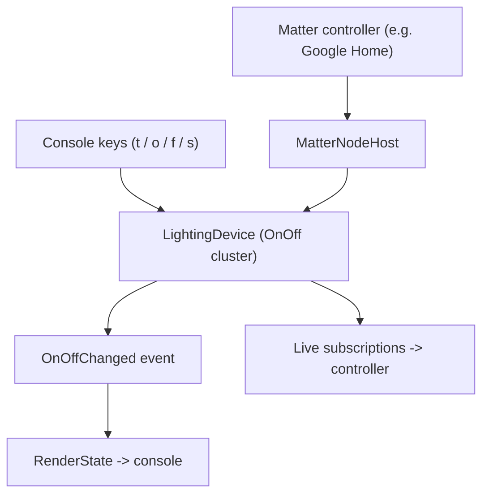

# RIoT2.Matter.OnOffSample

A runnable **console sample** for the [`RIoT2.Matter`](../RIoT2/RIoT2.Matter/README.md) stack. It hosts a
**Matter On/Off Light** node on **.NET 9**, prints an onboarding QR code, and lets you toggle the light
from the keyboard — while any commissioned Matter controller (Apple Home, Google Home, Amazon,
`chip-tool`, …) observes the same state, and vice versa.

**At a glance**

- 💡 Composes an **On/Off Light** (device type `0x0100`) with `LightingDevice.Build`.
- 📇 Prints an ASCII **QR code** whose passcode is bound to the on-device SPAKE2+ verifier.
- 🔒 Mints self-consistent **TEST** attestation credentials (PAA → PAI → DAC + CD) on first run.
- 🔁 **Bidirectional** state: console keys and controller commands both update the model and raise events.
- 🚀 One-line hosting via `MatterNodeHost` (transport, Secure Channel, Interaction Model, DNS-SD).

---

## Table of contents

- [What it does](#what-it-does)
- [Requirements](#requirements)
- [Build & run](#build--run)
- [Console controls](#console-controls)
- [How it works](#how-it-works)
- [Commissioning to a controller](#commissioning-to-a-controller)
- [Device attestation credentials](#device-attestation-credentials)
- [Setting up device attestation credentials](#setting-up-device-attestation-credentials)
- [Getting credentials from connectedhomeip](#getting-credentials-from-connectedhomeip)
- [Project layout](#project-layout)
- [Troubleshooting](#troubleshooting)
- [Related](#related)

---

## What it does

On start, the sample provisions an onboarding secret, composes an On/Off Light node, starts the host,
and renders the onboarding QR. Keyboard input drives the light; the model notifies live subscriptions,
so a paired controller stays in sync in real time.



## Requirements

- **.NET 9 SDK** or later. The project enables `ImplicitUsings` and `Nullable`.
- An **IPv6-capable** network interface. Matter is IPv6-centric; the operational UDP port is **5540**.
- A UTF-8 capable terminal (the sample sets `Console.OutputEncoding` so the ASCII QR renders correctly).

The project references the `RIoT2.Matter` library and two NuGet packages:

```xml
<ItemGroup>
  <PackageReference Include="QRCoder" Version="1.6.0" />
  <PackageReference Include="System.Security.Cryptography.Pkcs" Version="10.0.9" />
</ItemGroup>

<ItemGroup>
  <ProjectReference Include="..\RIoT2\RIoT2.Matter\RIoT2.Matter.csproj" />
</ItemGroup>
```

## Build & run

From the repository root:

```bash
dotnet run --project RIoT2.Matter.OnOffSample
```

Or from within the sample folder:

```bash
dotnet run
```

Expected console output (the QR is ASCII art; the passcode is randomly provisioned each run):

```text
=== Commission this On/Off Light to Google Home ===
Scan the QR below in the Google Home app (Add device → Matter):

  <ASCII QR code>

QR payload    : MT:Y.K90...
Manual code   : 3497-011-2332
Setup passcode: 20202021
Discriminator : 0xF00 (3840)

[10:32:14] OnOff = OFF  (changed by: initial)
Keys:  [t] toggle   [o] on   [f] off   [s] show state   [h] help   [q] quit
```

## Console controls

| Key | Action                                             |
| --- | -------------------------------------------------- |
| `t` | Toggle On/Off                                      |
| `o` | Turn on                                            |
| `f` | Turn off                                           |
| `s` | Show current state                                 |
| `r` | Reopen a 900 s commissioning window (re-pair)      |
| `h` | Print the help line                                |
| `q` | Quit (stops the host and sends a DNS-SD goodbye)   |

Each change is echoed with the source that caused it (`initial`, `device`, or `query`), so
controller-driven changes are distinguishable from console-driven ones.

## How it works

`Program.Main` follows seven steps (see `Program.cs`):

1. **Provision onboarding once** — the scanned passcode and the on-device SPAKE2+ verifier come from
   the same bundle, so they can never diverge.
2. **Compose the node** with `LightingDevice.Build`, then **attach fabric persistence**
   (`FileFabricPersistence.Attach`) so commissioned fabrics survive restarts.
3. **Build the onboarding payload + QR** from the same passcode used for the verifier.
4. **Describe the commissionable identity** advertised over DNS-SD.
5. **Start the host** (`MatterNodeHost`): transport, sessions, Secure Channel (PASE/CASE), Interaction
   Model, and DNS-SD.
6. **Subscribe** to `OnOffChanged`, which fires for both console- and controller-driven changes.
7. **Run the console loop** to control the light.

The core composition:

```csharp
using RIoT2.Matter.Clusters;
using RIoT2.Matter.SecureChannel.Pase;

// 1. Provision the passcode + matching SPAKE2+ verifier together.
PaseProvisioning provisioning = PaseVerifierGenerator.Provision();

// 2. Compose an On/Off Light node (root endpoint + commissioning stack + lighting endpoint).
var options = new LightingDeviceOptions
{
    Information = new DeviceInformation
    {
        VendorId = new VendorId(0xFFF1),      // CSA test vendor id
        ProductId = 0x8000,                   // matches the connectedhomeip FFF1-8000 test DAC/PAI/CD
        VendorName = "RIoT2",
        ProductName = "Demo On/Off Light",
        SoftwareVersion = 1,
        SoftwareVersionString = "1.0.0",
        SerialNumber = "RIOT2-ONOFF-0001",
    },
    Attestation = SampleAttestation.Load(),
    BasicCommissioningInfo = new BasicCommissioningInfo(
        FailSafeExpiryLengthSeconds: 60,
        MaxCumulativeFailsafeSeconds: 900),
    NetworkInterfaces =
    [
        new NetworkInterface { Name = "eth0", IsOperational = true, Type = InterfaceType.Ethernet },
    ],
    Profile = LightingProfile.OnOffLight,     // On/Off Light (0x0100), no Level Control
    NodeLabel = "RIoT2 Demo Light",
    InitialOnOff = false,
};

using var device = LightingDevice.Build(options);
```

Wiring the model to console output and the console keys back into the model:

```csharp
// Model -> console: fires for BOTH console-driven and controller-driven changes.
device.OnOff.OnOffChanged += (_, _) => RenderState(device.OnOff.OnOff, "device");

// Console -> model: push a change in, which notifies live subscriptions.
device.OnOff.OnOff = !device.OnOff.OnOff; // toggle
```

## Commissioning to a controller

1. Run the sample and note the printed **QR payload**, **manual code**, **setup passcode**, and
   **discriminator** (`0x0F00`).
2. In your controller app choose **Add device → Matter** and scan the QR — or choose "enter code
   manually" and type the **manual code** in its grouped `XXXX-XXX-XXXX` form.
3. The controller discovers the node over DNS-SD (`_matterc._udp`), runs PASE then CASE, and completes
   commissioning. After that, controller commands and console keys keep the light in sync.

With `chip-tool` you can pair from the manual code directly (digits only, no hyphens):

### Defining the device in the Google Home Developer Console

Google Home will **not** commission a device whose VID/PID it doesn't recognize. Because this sample
advertises the CSA **test** vendor id (`0xFFF1`) with product id `0x8000` and mints TEST attestation
credentials, you must register a matching Matter integration in the
[Google Home Developer Console](https://console.home.google.com) before pairing. Do this once per
Google account/project.

1. Sign in at <https://console.home.google.com> with the same Google account used by the Google Home
   app on your phone.
2. Create (or open) a **project**, then open **Matter → Add Matter integration** (also called
   *Create your Matter integration*).
3. In **Setup**, give the integration a name and continue.
4. In **Develop**, enter the device identifiers **exactly matching** what the sample advertises:
   - **Vendor ID (VID):** `0xFFF1` — select the *Test VID* option (Google exposes `0xFFF1`–`0xFFF4`
     for development).
   - **Product ID (PID):** `0x8000`.
   > These must equal `LightingDeviceOptions.Information.VendorId` / `ProductId` in `Program.cs`. If
   > you change them there, update the console entry (and the minted credentials) to match.
5. In **Setup and branding**, set a **product name** and (optionally) a device icon. The device type is
   an **On/Off Light** (`0x0100`).
6. **Save** the integration.
7. On your phone, ensure the Google Home app and the device running the sample are on the **same LAN**
   with **IPv6** enabled, and that your Android device meets Google's minimum requirements for
   developer/test devices.
8. Allow a few minutes for the new integration to propagate, then commission the device as in the
   steps above (**Add device → Matter → scan the QR** or enter the manual code).

> **Test-only material:** the sample's DAC/PAI chain roots at the CSA **test** PAA, so it is accepted
> only when the integration is registered under a **Test VID**. It will be rejected by a production
> attestation flow. For anything beyond local development, obtain production credentials with a
> CSA-allocated VID and register a production integration.

### Persisting fabrics across restarts

Commissioning installs the node's operational credentials — the NOC, the fabric entry, its ACL, and
the group (IPK) keys — into the Operational Credentials manager. `Program.cs` seals that state to a
single `fabrics.dat` file so it survives process restarts:

```csharp
using var device = LightingDevice.Build(options);
// Attach right after Build, while the manager is still empty: Restore() re-seeds the fabric table // (and, via the manager's Changed event, the ACL and group keys), then every subsequent change is // written back to disk in one AES-256-GCM envelope — no plaintext secrets are stored. using var persistence = FileFabricPersistence.Attach( device.Commissioning.Manager, path: Path.Combine(AppContext.BaseDirectory, "fabrics.dat"), keyPassword: DeviceBoundSecret(options.Information.SerialNumber));
```

The `keyPassword` seals the snapshot and **must be reproducible** across restarts. This sample derives
it deterministically from the serial number for demonstration; a real device MUST source it from a
hardware-sealed secret (TPM/secure-element), never a public identifier.

With persistence in place, a restart reloads the committed fabrics, CASE succeeds, and you no longer
need to remove and re-add the device on the controller. Because the node is no longer factory-new, it
also stops auto-opening a commissioning window on start — press `r` to reopen one when you actually
want to re-pair. **Delete `fabrics.dat` to return the node to factory-new.**

## Device attestation credentials

`SampleAttestation.Load()` follows the connectedhomeip **"Creating Matter certificates"** (`chip-cert`)
process, but implemented in managed .NET so no external tooling is needed. It uses the fixed test
**root PAA** and **CD-signing** certificates shipped in `Certificates/` as inputs, then mints a
**PAI**, **DAC** (+ keys), and a matching **Certification Declaration** for the configured
**VID/PID**, persisting them under `credentials/`.

### Inputs: fixed test material in `Certificates/`

These are Matter's own test certificates (the `--ca-*` inputs to `gen-att-cert` and the `--cert`/`--key`
inputs to `gen-cd` in the guide). They are committed with the sample and never modified:
Certificates/ ├── Chip-Test-PAA-NoVID-Cert.pem   # root PAA (self-signed, no VID) — trust anchor for the DAC chain ├── Chip-Test-PAA-NoVID-Key.pem    # PAA signing key — signs the minted PAI ├── Chip-Test-CD-Signing-Cert.pem  # CD-signing certificate (well-known test SKI) └── Chip-Test-CD-Signing-Key.pem   # CD-signing key — signs the Certification Declaration

### Output: minted credentials in `credentials/`

On first run (when the VID/PID-specific files are absent), the sample mints and persists them, keyed
by the configured **VID `0xFFF2` / PID `0x8001` / device-type `0x0100`**:
credentials/ ├── test-PAI-FFF2-cert.der            # PAI, signed by the PAA (gen-att-cert --type i, subject-vid only) ├── test-PAI-FFF2-key.pkcs8           # PAI private key ├── test-DAC-FFF2-8001-cert.der       # DAC, signed by the PAI (gen-att-cert --type d, subject-vid + subject-pid) ├── test-DAC-FFF2-8001-key.pkcs8      # DAC private key └── Chip-Test-CD-FFF2-8001.der        # Certification Declaration (CMS), signed by Chip-Test-CD-Signing
````````markdown

This mirrors the guide's commands:

| Guide command                         | Sample step                                                            |
| ------------------------------------- | ---------------------------------------------------------------------- |
| `gen-att-cert --type i` (PAI)         | Signed by `Chip-Test-PAA-NoVID`; subject-cn `Matter Test PAI`, subject-vid only. |
| `gen-att-cert --type d` (DAC)         | Signed by the minted PAI; subject-cn `Matter Test DAC 0`, subject-vid + subject-pid. |
| `gen-cd` (CD)                         | Signed by `Chip-Test-CD-Signing`; VID/PID/device-type match the advertised values. |

### Changing the VID/PID

`SampleAttestation` regenerates each artifact **only when it is absent**. To mint credentials for a
different VID/PID:

1. Update `VendorId` / `ProductId` in `SampleAttestation.cs` (and the advertised values in `Program.cs`).
2. Delete the stale files in `credentials/` so a fresh, matching set is minted on the next run.

The output filenames embed the VID/PID (`test-DAC-<VID>-<PID>-cert.der`), so distinct pairs coexist.

### Not for Google Home

These are CSA **test** credentials: the DAC chain roots at the test PAA and the CD is signed with the
test CD-signing key. Test-mode commissioners (`chip-tool`, Home Assistant) accept them, but a
production controller (e.g. a real Google Home) requires a Google-validated **real** VID and will
reject this material. Use `chip-cert` with your real VID/PID for that path. See the Matter Core
Specification, section 6.2.

## Project layout

| File                                 | Purpose                                                                                     |
| ------------------------------------- | ------------------------------------------------------------------------------------------- |
| `Program.cs`                        | The application entry point; hosts the Matter stack and runs the console loop.             |
| `README.md`                          | You're reading it. Helps you get, build, and run the sample.                              |
| `SampleAttestation.cs`              | Mints/loads the TEST DAC/PAI/CD material under `credentials/` from the `Certificates/` inputs. |
| `Certificates/`                     | Fixed test root PAA + CD-signing certs (inputs to credential generation); committed.        |
| `credentials/`                      | Minted on first run from `Certificates/`; not required to be committed.                     |