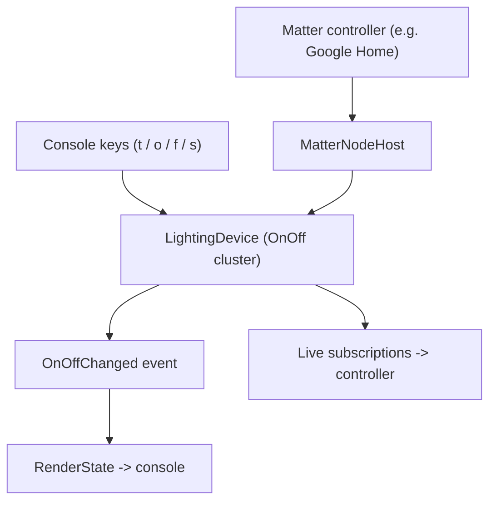

# RIoT2.Matter.OnOffSample

A runnable **console sample** for the [`RIoT2.Matter`](../RIoT2/RIoT2.Matter/README.md) stack. It hosts a
**Matter On/Off Light** node on **.NET 9**, prints an onboarding QR code, and lets you toggle the light
from the keyboard — while any commissioned Matter controller (Apple Home, Google Home, Amazon,
`chip-tool`, …) observes the same state, and vice versa.

**At a glance**

- 💡 Composes an **On/Off Light** (device type `0x0100`) with `LightingDevice.Build`.
- 📇 Prints an ASCII **QR code** whose passcode is bound to the on-device SPAKE2+ verifier.
- 🔒 Mints self-consistent **TEST** attestation credentials (PAA → PAI → DAC + CD) on first run.
- 🔁 **Bidirectional** state: console keys and controller commands both update the model and raise events.
- 🚀 One-line hosting via `MatterNodeHost` (transport, Secure Channel, Interaction Model, DNS-SD).

---

## Table of contents

- [What it does](#what-it-does)
- [Requirements](#requirements)
- [Build & run](#build--run)
- [Console controls](#console-controls)
- [How it works](#how-it-works)
- [Commissioning to a controller](#commissioning-to-a-controller)
- [Device attestation credentials](#device-attestation-credentials)
- [Project layout](#project-layout)
- [Troubleshooting](#troubleshooting)
- [Related](#related)

---

## What it does

On start, the sample provisions an onboarding secret, composes an On/Off Light node, starts the host,
and renders the onboarding QR. Keyboard input drives the light; the model notifies live subscriptions,
so a paired controller stays in sync in real time.



## Requirements

- **.NET 9 SDK** or later. The project enables `ImplicitUsings` and `Nullable`.
- An **IPv6-capable** network interface. Matter is IPv6-centric; the operational UDP port is **5540**.
- A UTF-8 capable terminal (the sample sets `Console.OutputEncoding` so the ASCII QR renders correctly).

The project references the `RIoT2.Matter` library and two NuGet packages:

```xml
<ItemGroup>
  <PackageReference Include="QRCoder" Version="1.6.0" />
  <PackageReference Include="System.Security.Cryptography.Pkcs" Version="10.0.9" />
</ItemGroup>

<ItemGroup>
  <ProjectReference Include="..\RIoT2\RIoT2.Matter\RIoT2.Matter.csproj" />
</ItemGroup>
```

## Build & run

From the repository root:

```bash
dotnet run --project RIoT2.Matter.OnOffSample
```

Or from within the sample folder:

```bash
dotnet run
```

Expected console output (the QR is ASCII art; the passcode is randomly provisioned each run):

```text
=== Commission this On/Off Light to Google Home ===
Scan the QR below in the Google Home app (Add device → Matter):

  <ASCII QR code>

QR payload    : MT:Y.K90...
Manual code   : 3497-011-2332
Setup passcode: 20202021
Discriminator : 0xF00 (3840)

[10:32:14] OnOff = OFF  (changed by: initial)
Keys:  [t] toggle   [o] on   [f] off   [s] show state   [h] help   [q] quit
```

## Console controls

| Key | Action                                             |
| --- | -------------------------------------------------- |
| `t` | Toggle On/Off                                      |
| `o` | Turn on                                            |
| `f` | Turn off                                           |
| `s` | Show current state                                 |
| `r` | Reopen a 900 s commissioning window (re-pair)      |
| `h` | Print the help line                                |
| `q` | Quit (stops the host and sends a DNS-SD goodbye)   |

Each change is echoed with the source that caused it (`initial`, `device`, or `query`), so
controller-driven changes are distinguishable from console-driven ones.

## How it works

`Program.Main` follows seven steps (see `Program.cs`):

1. **Provision onboarding once** — the scanned passcode and the on-device SPAKE2+ verifier come from
   the same bundle, so they can never diverge.
2. **Compose the node** with `LightingDevice.Build`, then **attach fabric persistence**
   (`FileFabricPersistence.Attach`) so commissioned fabrics survive restarts.
3. **Build the onboarding payload + QR** from the same passcode used for the verifier.
4. **Describe the commissionable identity** advertised over DNS-SD.
5. **Start the host** (`MatterNodeHost`): transport, sessions, Secure Channel (PASE/CASE), Interaction
   Model, and DNS-SD.
6. **Subscribe** to `OnOffChanged`, which fires for both console- and controller-driven changes.
7. **Run the console loop** to control the light.

The core composition:

```csharp
using RIoT2.Matter.Clusters;
using RIoT2.Matter.SecureChannel.Pase;

// 1. Provision the passcode + matching SPAKE2+ verifier together.
PaseProvisioning provisioning = PaseVerifierGenerator.Provision();

// 2. Compose an On/Off Light node (root endpoint + commissioning stack + lighting endpoint).
var options = new LightingDeviceOptions
{
    Information = new DeviceInformation
    {
        VendorId = new VendorId(0xFFF1),      // CSA test vendor id
        ProductId = 0x8000,                   // matches the connectedhomeip FFF1-8000 test DAC/PAI/CD
        VendorName = "RIoT2",
        ProductName = "Demo On/Off Light",
        SoftwareVersion = 1,
        SoftwareVersionString = "1.0.0",
        SerialNumber = "RIOT2-ONOFF-0001",
    },
    Attestation = SampleAttestation.Load(),
    BasicCommissioningInfo = new BasicCommissioningInfo(
        FailSafeExpiryLengthSeconds: 60,
        MaxCumulativeFailsafeSeconds: 900),
    NetworkInterfaces =
    [
        new NetworkInterface { Name = "eth0", IsOperational = true, Type = InterfaceType.Ethernet },
    ],
    Profile = LightingProfile.OnOffLight,     // On/Off Light (0x0100), no Level Control
    NodeLabel = "RIoT2 Demo Light",
    InitialOnOff = false,
};

using var device = LightingDevice.Build(options);
```

Wiring the model to console output and the console keys back into the model:

```csharp
// Model -> console: fires for BOTH console-driven and controller-driven changes.
device.OnOff.OnOffChanged += (_, _) => RenderState(device.OnOff.OnOff, "device");

// Console -> model: push a change in, which notifies live subscriptions.
device.OnOff.OnOff = !device.OnOff.OnOff; // toggle
```

## Commissioning to a controller

1. Run the sample and note the printed **QR payload**, **manual code**, **setup passcode**, and
   **discriminator** (`0x0F00`).
2. In your controller app choose **Add device → Matter** and scan the QR — or choose "enter code
   manually" and type the **manual code** in its grouped `XXXX-XXX-XXXX` form.
3. The controller discovers the node over DNS-SD (`_matterc._udp`), runs PASE then CASE, and completes
   commissioning. After that, controller commands and console keys keep the light in sync.

With `chip-tool` you can pair from the manual code directly (digits only, no hyphens):

### Persisting fabrics across restarts

Commissioning installs the node's operational credentials — the NOC, the fabric entry, its ACL, and
the group (IPK) keys — into the Operational Credentials manager. `Program.cs` seals that state to a
single `fabrics.dat` file so it survives process restarts:

using var device = LightingDevice.Build(options);
// Attach right after Build, while the manager is still empty: Restore() re-seeds the fabric table // (and, via the manager's Changed event, the ACL and group keys), then every subsequent change is // written back to disk in one AES-256-GCM envelope — no plaintext secrets are stored. using var persistence = FileFabricPersistence.Attach( device.Commissioning.Manager, path: Path.Combine(AppContext.BaseDirectory, "fabrics.dat"), keyPassword: DeviceBoundSecret(options.Information.SerialNumber));


The `keyPassword` seals the snapshot and **must be reproducible** across restarts. This sample derives
it deterministically from the serial number for demonstration; a real device MUST source it from a
hardware-sealed secret (TPM/secure-element), never a public identifier.

With persistence in place, a restart reloads the committed fabrics, CASE succeeds, and you no longer
need to remove and re-add the device on the controller. Because the node is no longer factory-new, it
also stops auto-opening a commissioning window on start — press `r` to reopen one when you actually
want to re-pair. **Delete `fabrics.dat` to return the node to factory-new.**

## Device attestation credentials

`SampleAttestation.Load()` provisions the attestation **chain** (PAA → PAI → DAC + key) and the
**Certification Declaration** *independently*, under `credentials/`. Certificates and the CD are
accepted as **PEM or DER**, and the DAC key as **PKCS#8 or SEC1** in either encoding — so the
`connectedhomeip` test files drop in without any `openssl`/`chip-cert` conversion.

### Default: self-signed TEST material (first run)

With an empty `credentials/` folder, the sample mints a self-consistent P-256 **TEST** PKI
(PAA → PAI → DAC) and a matching CD, then persists them:

```text
credentials/
├── paa.der         # Product Attestation Authority (root)
├── pai.der         # Product Attestation Intermediate
├── dac.der         # Device Attestation Certificate
├── dac-key.pkcs8   # DAC private key
└── cd.der          # Certification Declaration (CMS), signed by an ephemeral test key
```

> ⚠️ **These are self-signed TEST credentials.** A production controller (e.g. a real Google Home)
> validates the DAC chain against the official CSA test PAA and the CD signature against the CSA
> CD-signing key, so it will **reject** this generated material. See the Matter Core Specification,
> section 6.2.

### Recommended: connectedhomeip test credentials (no `chip-cert`)

To be accepted by **test-mode commissioners** (`chip-tool`, Home Assistant), drop the `connectedhomeip`
test files (`credentials/test/…`) into `credentials/`. This node advertises **VID `0xFFF1` / PID
`0x8000` / device-type `0x0100`**, so use the matching `FFF1-8000` set:

| Copy from `connectedhomeip/credentials/test/…`             | Into `credentials/` as  |
| ---------------------------------------------------------- | ----------------------- |
| `attestation/Chip-Test-DAC-FFF1-8000-0000-Cert.der`        | `dac.der`               |
| `attestation/Chip-Test-PAI-FFF1-8000-Cert.der`             | `pai.der`               |
| `attestation/Chip-Test-DAC-FFF1-8000-0000-Key.pem`         | `dac-key.pem`           |
| `certification-declaration/Chip-Test-CD-Signing-Cert.pem`  | `cd-signing-cert.pem`   |
| `certification-declaration/Chip-Test-CD-Signing-Key.pem`   | `cd-signing-key.pem`    |

On the next run the sample keeps your dropped-in chain and **auto-generates `cd.der`** — signed with
the supplied CD-signing key so its `SubjectKeyIdentifier` matches the well-known test key that
commissioners trust. No `chip-cert`, WSL, or Docker required.

> The original `Chip-Test-CD-Signing-*.pem` filenames are also accepted as-is. Provide the DAC, PAI,
> and DAC key **together** — a partial chain makes the sample fall back to regenerating self-signed
> material. Delete the `credentials/` folder to start over.

### Retail ecosystems (Alexa, Google Home, Apple Home)

The test credentials above satisfy **development** commissioners only. A **retail** controller trusts
only the production DCL PAAs and the production CSA CD-signing certificate, so it will still reject
this material. Commissioning to a production ecosystem requires that vendor's Matter **developer
enrollment**, or a **CSA-issued VID** with a **production DAC/PAI + CD**.

## Project layout

| File                                | Responsibility                                                              |
| ----------------------------------- | --------------------------------------------------------------------------- |
| `Program.cs`                        | Entry point: provisioning, node composition, hosting, and the console loop. |
| `SampleAttestation.cs`              | Generates/loads the TEST DAC/PAI/PAA/CD material under `credentials/`.       |
| `ConsoleQr.cs`                      | Renders a Matter `MT:` onboarding string as an ASCII QR (via `QRCoder`).     |
| `RIoT2.Matter.OnOffSample.csproj`   | Project file (net9.0, package/project references).                          |
| `credentials/`                      | Generated on first run; not required to be committed.                       |
| `fabrics.dat`                       | Sealed fabric snapshot; written after commissioning. Delete to factory-reset. |

## Troubleshooting

- **Controller can't find the device** — ensure both machines share an IPv6-capable link and that UDP
  port **5540** and mDNS (UDP **5353**) are not blocked by a firewall.
- **Commissioning fails at attestation** — expected with the built-in TEST credentials on a production
  controller; use the `connectedhomeip` test credentials (see [above](#device-attestation-credentials)).
- **QR looks garbled** — use a UTF-8 capable terminal; the sample sets `Console.OutputEncoding` to UTF-8.

## Related

- [`RIoT2.Matter`](../RIoT2/RIoT2.Matter/README.md) — the portable, managed Matter stack this sample builds on.

> **Note:** a factory-new node auto-opens a commissioning window on start, so the passcode is
> immediately acceptable. The `Discriminator` in the QR payload must match the value advertised over
> DNS-SD — both are `0x0F00` in this sample. The manual code carries only the **short discriminator**
> (the top 4 bits of the 12-bit value), so a controller resolves the node by that reduced form.