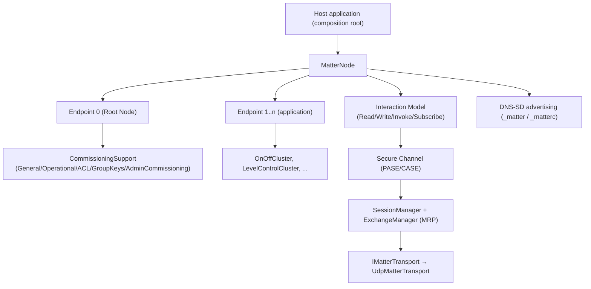

# RIoT2.Matter

A portable, managed **Matter protocol** implementation for **.NET 9**. It provides the building blocks
needed to expose a device as a Matter node — TLV codec, IPv6/UDP transport with MRP, the secure
channel (PASE/CASE), DNS-SD advertising & discovery, the Interaction Model (Read/Write/Invoke/Subscribe),
and a growing set of clusters — assembled into ready-to-run device types such as a lighting node.

> **Design goals:** wire-compatibility with the Matter specification and `connectedhomeip`,
> correctness/interoperability with real controllers (Apple Home, Google Home, Amazon, `chip-tool`),
> and **portability first** — everything builds and runs on x64 and ARM64 with no unmanaged/native
> dependencies.

**At a glance**

- 🧩 Compose a node from endpoints and clusters, or start from a device-type builder (`LightingDevice`).
- 🚀 One-line hosting: hand a node to `MatterNodeHost` and it wires transport, Secure Channel, Interaction Model, and DNS-SD.
- 🔒 Full commissioning: PASE → CASE, fabric table, Access Control, Group Keys, fail-safe lifecycle.
- 📇 QR onboarding whose passcode is bound to the on-device SPAKE2+ verifier (they cannot diverge).
- 📡 DNS-SD advertising for both commissionable (`_matterc._udp`) and operational (`_matter._tcp`) nodes.
- 🧪 Testable seams everywhere: `IMatterTransport`, `TimeProvider`, and in-memory fakes.

---

## Table of contents

- [Requirements](#requirements)
- [Build & test](#build--test)
- [Architecture](#architecture)
- [Quick start: compose a lighting device](#quick-start-compose-a-lighting-device)
- [Wiring physical I/O](#wiring-physical-io)
- [Transport](#transport)
- [Commissioning lifecycle](#commissioning-lifecycle)
- [Onboarding: QR code & passcode/verifier pairing](#onboarding-qr-code--passcodeverifier-pairing)
- [Interaction Model: read, write, invoke](#interaction-model-read-write-invoke)
- [DNS-SD advertising](#dns-sd-advertising)
- [Putting it all together](#putting-it-all-together)
- [Authoring a custom cluster](#authoring-a-custom-cluster)
- [Project layout](#project-layout)
- [Specification conformance & known gaps](#specification-conformance--known-gaps)
- [Security notes](#security-notes)
- [Contributing](#contributing)
- [Documentation quality](#documentation-quality)

---

## Requirements

- **.NET 9 SDK** or later. The project enables `ImplicitUsings` and `Nullable`, so examples below omit
  common `using` directives and assume a nullable-aware context.
- An **IPv6-capable** network interface. Matter is IPv6-centric; the default operational UDP port is
  **5540**. The bundled transport enables dual-mode sockets so IPv4 loopback works for local testing.

## Build & test

```bash
dotnet build

dotnet test
```

Add a reference to the library from your host application:

```xml
<ProjectReference Include="..\path\to\RIoT2.Matter.csproj" />
```

## Architecture

`RIoT2.Matter` is layered. A **node** hosts **endpoints**, and each endpoint hosts **clusters**.
The secure channel, transport, and DNS-SD layers sit underneath and are wired together in the host's
composition root.



| Layer            | Key types                                                                                                                                          |
| ---------------- | -------------------------------------------------------------------------------------------------------------------------------------------------- |
| Device model     | `MatterNode`, `Endpoint`, `Cluster`                                                                                                             |
| Device types     | `LightingDevice`, `LightingDeviceOptions`                                                                                                       |
| Clusters         | `OnOffCluster`, `LevelControlCluster`, `IdentifyCluster`, `DescriptorCluster`, `BasicInformationCluster`, `GeneralDiagnosticsCluster`, …         |
| Commissioning    | `CommissioningSupport`, `AdministratorCommissioningController`                                                                                   |
| Secure channel   | `PaseVerifierGenerator`, `PaseProvisioning`, `SetupPasscode`, `HandshakeSessionInstaller`                                                                                   |
| Onboarding       | `SetupPayload`, `QrCodePayload`, `DiscoveryCapabilities`, `IQrCodeRenderer`                                                                     |
| Discovery        | `MatterHostInfo`, `CommissionableServiceInfo`, `CommissionableAdvertisement`                                                                    |
| Transport        | `IMatterTransport`, `UdpMatterTransport`                                                                                                         |
| Hosting          | `MatterNodeHost`, `MatterAdvertisingInputProvider`, `HostAddresses`, `EndpointMessageTransport`                                                 |

---

## Quick start: compose a lighting device

`LightingDevice.Build` composes a complete node: the root endpoint (0) with Descriptor, Basic
Information, the commissioning-support stack, and General Diagnostics, plus a lighting endpoint with
Descriptor, Identify, On/Off, and (for the Dimmable profile) Level Control.

```csharp
using RIoT2.Matter.Clusters;
var options = new LightingDeviceOptions {
    // Fixed device facts backing Basic Information (and shared with DNS-SD advertising).
    Information = new DeviceInformation {
        VendorId = new VendorId(0xFFF1),          // CSA test vendor id
        ProductId = 0x8001,
        VendorName = "RIoT2",
        ProductName = "Demo Dimmable Light",
        SoftwareVersion = 1,
        SoftwareVersionString = "1.0.0",
    },

    // Pre-provisioned DAC/PAI/CD material and the DAC signer (minted by the vendor's attestation PKI).
    Attestation = attestationCredentials,         // see DeviceAttestationCredentials

    // Fail-safe timing bounds exposed to commissioners by General Commissioning.
    BasicCommissioningInfo = new BasicCommissioningInfo(
        FailSafeExpiryLengthSeconds: 60,
        MaxCumulativeFailsafeSeconds: 900),

    // Interfaces reported by General Diagnostics.
    NetworkInterfaces = new[]
    {
        new NetworkInterface { Name = "eth0", IsOperational = true, Type = InterfaceType.Ethernet },
    },

    Profile = LightingProfile.DimmableLight,      // OnOffLight omits Level Control
    NodeLabel = "Living Room Lamp",
    InitialOnOff = false,
    InitialLevel = 254,
};
using var device = LightingDevice.Build(options);
```

`LightingDevice` exposes the cluster handles the host drives (`OnOff`, `LevelControl`, `Identify`),
the composed `Node`, and the `Commissioning` stack. Dispose it on shutdown to release the
timer-backed clusters and unhook the commissioning events.

---

## Wiring physical I/O

Clusters raise change events so the host can drive the physical output, and expose settable state so
device logic (a physical switch/dimmer) can push changes back into the model — which in turn notifies
any live subscriptions.

```csharp
// Model → hardware: apply cluster state to the physical device.
device.OnOff.OnOffChanged += (_, _) => relay.Set(device.OnOff.OnOff);
device.LevelControl!.CurrentLevelChanged += (_, _) => dimmer.SetLevel(device.LevelControl.CurrentLevel);

// Hardware → model: a physical switch/dimmer pushes state in (notifies subscriptions + raises events).
physicalSwitch.Pressed += (_, _) => device.OnOff.OnOff = !device.OnOff.OnOff;
physicalDimmer.Moved   += (_, level) => device.LevelControl!.SetCurrentLevel(level);
```


For the Dimmable profile, On/Off and Level Control are already coupled in both directions by the
builder: an off-to-on edge restores `CurrentLevel` to `OnLevel`, and the `*WithOnOff` level commands
drive On/Off.

---

## Transport

`UdpMatterTransport` is the portable, dual-mode IPv6 UDP transport (default port **5540**). It
implements `IMatterTransport`, so the message/session layers can be tested against an in-memory fake
instead of a real socket.

```csharp
using RIoT2.Matter.Transport;
await using var transport = new UdpMatterTransport(); // binds [::]:5540, dual-mode
transport.DatagramReceived += (_, datagram) => { // Feed inbound datagrams into the message/session layer.
    messageLayer.Receive(datagram);
};
await transport.StartAsync(cancellationToken);

// Outbound: send an already-framed Matter message to a peer.
await transport.SendAsync(payload, destinationEndPoint, cancellationToken);
```

`LocalEndPoint` reports the bound address once started; `DisposeAsync` stops the receive loop and
closes the socket.

---

## Commissioning lifecycle

`CommissioningSupport.AddToRoot` assembles and wires the root-endpoint commissioning clusters —
General Commissioning (0x0030), Operational Credentials (0x003E), Access Control (0x001F), Group Key
Management (0x003F), Administrator Commissioning (0x003C), and (when an Ethernet network id is
supplied) Network Commissioning (0x0031). It also connects the fail-safe and fabric lifecycle:
completing commissioning commits the pending fabric, a fail-safe timeout rolls it back, and AddNOC
seeds the fabric's Administer ACL entry and IPK group key set.

`LightingDevice.Build` calls this for you, but you can wire it directly on any node:

```csharp
var support = CommissioningSupport.AddToRoot(
    node.Root,
    attestationCredentials,
    basicCommissioningInfo,
    ethernetNetworkId: macAddressBytes
);

// The manager doubles as the IFabricStore the CASE responder authenticates against.
var installer = new HandshakeSessionInstaller(sessions, support.Manager);
```


The commissioning window controls when a temporary PASE responder runs and when DNS-SD switches to
commissionable advertising. Subscribe to the controller's lifecycle events in the composition root:

```csharp
support.AdministratorCommissioning.WindowOpened += (_, e) => {
    // e.Request carries the enhanced PAKE parameters (or null for a basic window).
    paseResponder.Open(e.Request);
    advertiser.SwitchToCommissionable();
};

support.AdministratorCommissioning.WindowClosed += (_, _) => {
    paseResponder.Close();
    advertiser.SwitchToOperational();
};
```

> `MatterNodeHost` wires this lifecycle for you: its `CommissioningPaseResponder` starts and stops with
> the window, and the DNS-SD advertiser switches commissionable↔operational off the same signal via
> `MatterAdvertisingInputProvider`. Handle these events yourself only when building a custom host.

---

## Onboarding: QR code & passcode/verifier pairing

The setup passcode is the SPAKE2+ password. To guarantee the passcode a user scans can **never**
drift from the verifier the device authenticates against, generate both from a single
`PaseProvisioning` bundle and use its passcode as the source of truth for the QR payload.

```csharp
using RIoT2.Matter.Onboarding;
using RIoT2.Matter.SecureChannel.Pase;

// One provisioning step yields the passcode, PBKDF parameters, and the matching SPAKE2+ verifier.
PaseProvisioning provisioning = PaseVerifierGenerator.Provision();

// Provision the verifier onto the device (this is what PASE authenticates against).
byte[] verifierBlob = PaseVerifierGenerator.SerializeVerifier(provisioning.Verifier);
// ... store verifierBlob + provisioning.Parameters on the device / in the commissioning window ...

// Build the onboarding payload from the SAME passcode that produced the verifier.
var payload = new SetupPayload {
    VendorId = options.Information.VendorId,
    ProductId = options.Information.ProductId,
    DiscoveryCapabilities = DiscoveryCapabilities.OnNetwork, // | Ble | SoftAccessPoint
    Discriminator = 0x0F00,                                  // pairs with the DNS-SD _L/_S subtypes
    Passcode = provisioning.Passcode,                        // source of truth — cannot diverge
};
string qr = QrCodePayload.Encode(payload); // e.g. "MT:Y.K90..." (MT: prefix + Base38)
```

`SetupPayload.ToString()` redacts the passcode, so it is never written to logs in plaintext. Rendering
the QR string to an image is deliberately kept out of the portable core — supply an `IQrCodeRenderer`
if you need PNG/SVG output:

```csharp
byte[] image = qrRenderer.Render(qr); // your IQrCodeRenderer implementation
```

Decoding (controller side) round-trips the same payload:

```csharp
if (QrCodePayload.TryDecode(qr, out SetupPayload decoded))
{
    // decoded.Discriminator, decoded.VendorId, decoded.Passcode, ...
}
```

> **Discriminator alignment:** the 12-bit `Discriminator` in the payload must match the DNS-SD
> `_L`/`_S` subtypes advertised by the commissionable node (see below), so a controller can find the
> device it scanned.

---

## Interaction Model: read, write, invoke

Every `Cluster` exposes the read/write/invoke surface the Interaction Model engine binds against. You
can also drive it directly for testing. Reads and writes carry TLV payloads; commands take opaque TLV
fields and return a `CommandResponse`.

```csharp
// Invoke On/Off Toggle (0x0006 / 0x02) with no fields.
var response = await device.OnOff.InvokeCommandAsync(
    commandId: new CommandId(0x02),
    fields: ReadOnlyMemory<byte>.Empty
);

// Read the OnOff attribute (0x0000) into a TLV writer.
var buffer = new ArrayBufferWriter<byte>();
var status = await device.OnOff.ReadAttributeAsync(
    attributeId: new AttributeId(0x0000),
    writer: new TlvWriter(buffer),
    tag: TlvTag.Anonymous
);
```


Global attributes (`ClusterRevision`, `FeatureMap`, `AttributeList`, `AcceptedCommandList`,
`GeneratedCommandList`, `EventList`) are served by the base class automatically. Every successful
attribute mutation bumps `DataVersion` and notifies the node's change broker so live subscriptions
report promptly.

---

## DNS-SD advertising

Commissionable-node metadata is described by `CommissionableServiceInfo` and turned into a
`_matterc._udp` service instance (subtypes `_L`/`_S`/`_V`/`_T`/`_CM`; TXT keys `D`/`VP`/`CM`/`DT`/`DN`/…)
by `CommissionableAdvertisement`, using node-wide host facts from `MatterHostInfo`.


```csharp
using RIoT2.Matter.Discovery.Mdns;
var host = new MatterHostInfo {
    HostName = hostName,          // e.g. <64-bit host id>.local
    Addresses = ipv6Addresses,
    Port = UdpMatterTransport.DefaultPort,
};
var service = new CommissionableServiceInfo {
    InstanceId = instanceId,        // random, stable 64-bit id forming the instance name
    Discriminator = 0x0F00,         // must match the QR payload's Discriminator
    Mode = CommissioningMode.Basic, // open commissioning window (CM=1)
    VendorId = options.Information.VendorId,
    ProductId = options.Information.ProductId, // DeviceType, DeviceName, ... are optional
};
DnsSdService advertisement = CommissionableAdvertisement.Build(service, host);
```

Once commissioned, the node switches to operational `_matter._tcp` advertising
(`<CompressedFabricId>-<NodeId>` instance, one record set per fabric).

---

## Putting it all together

`MatterNodeHost` is the composition root: it binds the transport into the message/session stack,
installs the Secure Channel (PASE responder + CASE server) and Interaction Model handlers, provisions
the PASE verifier, auto-opens the factory commissioning window on a not-yet-commissioned node, and
drives DNS-SD advertising off the commissioning-window lifecycle. Compose a device, describe how it
advertises, and hand both to the host.

```csharp
using RIoT2.Matter;
using RIoT2.Matter.Clusters;

// Composed device: exposes the cluster handlers + node + commissioning support stack.
using var device = LightingDevice.Build(options);

// The hosted node (and its endpoints) is accessible as well:
var node = device.Node;

// Control through clusters:
device.OnOff.OnOff = true;                 // immediate on/off
device.LevelControl!.SetCurrentLevel(254); // device-driven level change (1..254)
```

---

> The exact message-layer, `sessions`, `paseResponder`, and `caseServer` wiring depends on your host;
> the point is the order: **transport → sessions → commissioning → clusters**.

---

## Authoring a custom cluster

Derive from `Cluster`, back your attributes with an `AttributeStore` (which handles TLV encode/decode,
constraint checks, and automatic `DataVersion` bumps), and override the core read/invoke hooks. Add
the cluster to an endpoint with `Endpoint.AddCluster`, which binds it to the node's event and change
sinks.

```csharp
using RIoT2.Matter.Device;
public sealed class SampleCluster : Cluster {
    public static readonly ClusterId ClusterId = new(0xFC00); // manufacturer-specific range
    private const uint MeasuredValueId = 0x0000;

    private static readonly AttributeId[] Attributes = [new(MeasuredValueId)];

    private readonly AttributeStore _attributes;
    private readonly Attribute<ushort> _measured;

    public SampleCluster(ushort initial = 0)
    {
        _attributes = new AttributeStore(IncrementDataVersion);
        _measured = _attributes.Add(new AttributeId(MeasuredValueId), TlvCodec.UInt16, initial);
    }

    public override ClusterId Id => ClusterId;
    public override ushort ClusterRevision => 1;
    public override IReadOnlyCollection<AttributeId> AttributeIds => Attributes;

    /// <summary>Push a new reading in from device logic; notifies subscriptions automatically.</summary>
    public ushort MeasuredValue
    {
        get => _measured.Value;
        set => _measured.Value = value; // Attribute<T>.Set → change broker → IncrementDataVersion
    }

    protected override ValueTask<InteractionModelStatusCode> ReadAttributeCoreAsync(
        AttributeId attributeId, TlvWriter writer, TlvTag tag, InteractionContext context, CancellationToken ct)
        => new(_attributes.TryRead(attributeId, writer, tag)
            ? InteractionModelStatusCode.Success
            : InteractionModelStatusCode.UnsupportedAttribute);
}

// Composition:
var node = new MatterNode();
var endpoint = node.AddEndpoint(new EndpointId(1));
endpoint.AddCluster(new SampleCluster());
```


To generate events, call the protected `EmitEvent`; to expose commands, override
`InvokeCommandCoreAsync` and declare `AcceptedCommandIds`.

---

## Project layout

| Folder | Contents |
| --- | --- |
| `Device/` | `MatterNode`, `Endpoint`, `Cluster`, event/change stores, `DeviceInformation` |
| `Clusters/` | Cluster implementations, `LightingDevice`, `CommissioningSupport`, attestation types |
| `SecureChannel/` | PASE/CASE handshakes, `PaseVerifierGenerator`, `PaseProvisioning`, `SetupPasscode` |
| `Onboarding/` | `SetupPayload`, `QrCodePayload`, `DiscoveryCapabilities`, `IQrCodeRenderer` |
| `Discovery/Mdns/` | DNS-SD codec, advertising, discovery (`MatterHostInfo`, `CommissionableAdvertisement`) |
| `Messaging/` | Message framing, exchanges, MRP, session manager |
| `Transport/` | `IMatterTransport`, `UdpMatterTransport` |
| `Hosting/` | Composition root + host glue (`MatterNodeHost`, `MatterAdvertisingInputProvider`, `HostAddresses`, `EndpointMessageTransport`) |
| `InteractionModel/` | Read/Write/Invoke/Subscribe engines and TLV building blocks |
| `Credentials/` | Certificate parsing and validation (`MatterCertificateValidator`, `MatterCertificateVerifier`) |

---

## Specification conformance & known gaps

Implemented and interoperable per the Matter Core Specification:

- ✅ TLV encode/decode primitives.
- ✅ IPv6/UDP transport + exchange/message layer with **MRP**, secure session manager (counters,
  replay protection, AES-CCM AEAD, privacy `P`-flag).
- ✅ Secure Channel: **PASE** (commissioning) then **CASE** (operational), installing operational
  sessions, with **CASE session resumption** (Sigma2_Resume) to re-establish sessions without a full
  Sigma1/2/3 handshake.
- ✅ **DNS-SD/mDNS** advertising & discovery (operational `_matter._tcp`, commissionable `_matterc._udp`).
- ✅ **Interaction Model**: Read / Write / Invoke / Subscribe, timed interactions, report chunking,
  event generation, element-wise list writes.
- ✅ Commissioning-support clusters (General/Operational Credentials/Network/Access Control/Admin
  Commissioning/Group Key Management/General Diagnostics).
- ✅ Application clusters: Identify, On/Off, Level Control (with On/Off coupling).
- ✅ Composed **lighting device type** (On/Off Light 0x0100, Dimmable Light 0x0101).
- ✅ **Certificate policy enforcement**: validity-period + role-based BasicConstraints/KeyUsage/EKU
  checks (`MatterCertificateValidator`), enforced by `OperationalCredentialsManager` on
  AddTrustedRoot / AddNOC / UpdateNOC.

Known gaps / deferred (contributions welcome):

- ⏳ **Group-cast** message security path end to end.
- ⏳ **BLE/BTP** transport (only IPv6/UDP is provided).
- ⏳ MRP **standalone acknowledgements** in all paths.
- ⏳ Wi-Fi/Thread Network Commissioning Scan/Add/Connect commands (Ethernet feature only).
- ⏳ Manual pairing-code encoding (QR onboarding is available).

---

## Security notes

- **Passcode/verifier binding.** Always source the QR passcode from the same `PaseProvisioning` bundle
  that produced the on-device verifier (see [Onboarding](#onboarding-qr-code--passcodeverifier-pairing)).
  Never mint a QR passcode independently of the verifier.
- **Secret material.** `SetupPayload.ToString()` redacts the passcode. `PaseVerifierGenerator` derives
  and discards the SPAKE2+ secret `w1`, provisioning only `w0` and `L`. Attestation keys are injected,
  not generated, so they can live in a secure element behind `ICaseOperationalKey`.
- **Certificate validation.** Trusted roots, NOCs, and ICACs are checked for validity period and the
  role-mandated extensions before a fabric is added; a node lacking a reliable clock (time before the
  Matter epoch) skips the validity-window check per spec §6.5.10.
- **No crypto shortcuts.** Keep TLV encoding, message framing, and crypto byte-compatible with the
  spec; do not weaken commissioning/operational security for convenience.

---

## Contributing

When implementing a feature, reference the Matter specification and the upstream `connectedhomeip`
behavior, and prefer correctness and interoperability with real controllers over convenience. Keep
TLV encoding, message framing, and crypto **byte-compatible** with the spec, never weaken
commissioning/operational security, and ensure every addition builds and runs on **x64 and ARM64**
with no unmanaged/native dependencies. Grow the library incrementally, cluster-by-cluster.

---

## Documentation quality

Keep `README.md` valid, readable, and Markdown-renderable. Use correctly closed fenced code blocks, accurate language identifiers, and valid example code where snippets are intended to demonstrate API usage.