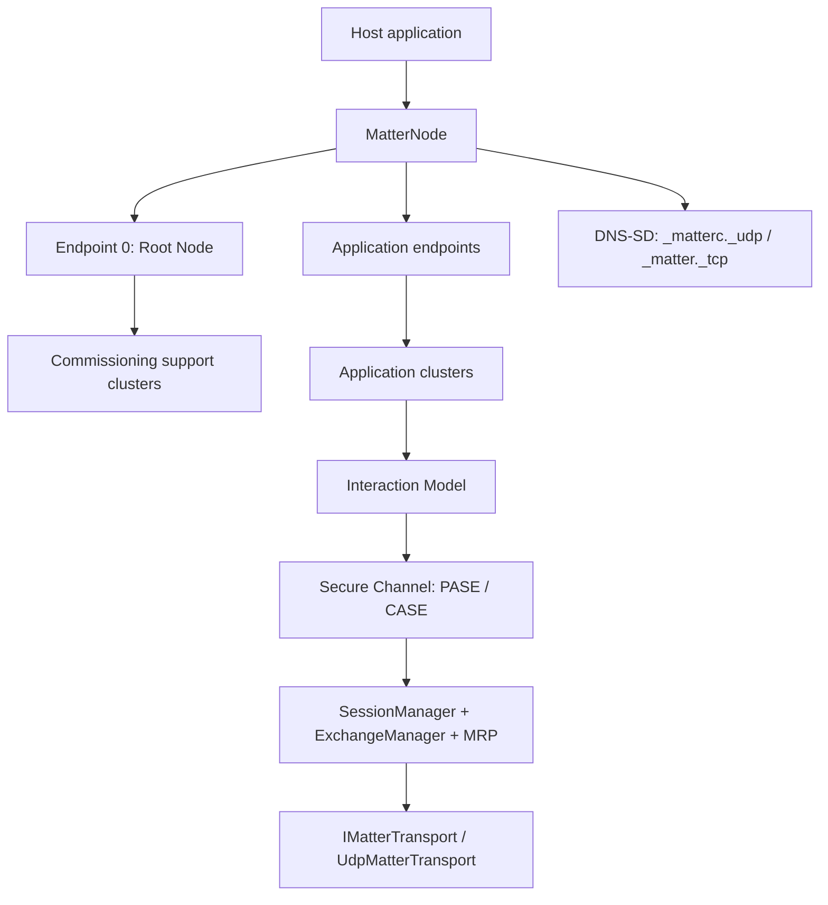

Applies to: the `RIoT2.Matter` core library and the subprojects in this repository.

# Architecture

`RIoT2.Matter` is layered around a Matter node model. A node owns endpoints, endpoints own clusters,
and the hosting layer binds that model to transport, secure sessions, the Interaction Model and
DNS-SD advertising.

## Layers

| Layer | Main types |
| --- | --- |
| Device model | `MatterNode`, `Endpoint`, `Cluster`, `DeviceInformation`, event/change stores |
| Data model | `AttributeStore`, `Attribute<T>`, `Cluster` read/write/invoke hooks |
| Device types | `LightingDevice`, `LightingDeviceOptions`, Control Bridge and Aggregator builders |
| Clusters | Identify, On/Off, Level Control, Color Control, Thermostat, sensor clusters, Descriptor, Basic Information, commissioning clusters |
| Interaction Model | `ReadEngine`, write/invoke/subscribe transactions, report chunking and list handling |
| Messaging | message codec, exchange manager, MRP, secure and unsecured session handling |
| Secure Channel | PASE, CASE, resumption records, fabric table, attestation and certificate validation |
| Discovery | DNS-SD records, commissionable and operational advertisements, mDNS browser |
| Hosting | `MatterNodeHost`, advertising input provider, transport/session wiring |
| Crypto | managed crypto helpers including SPAKE2+ P-256 reference arithmetic |
| User Directed Commissioning | User Directed Commissioning message handling |
| Diagnostics | optional verbose tracing sink used by hosts and samples |

## Composition roots

- `LightingDevice.Build` composes endpoint 0 plus a lighting endpoint. It is the surface used by
  `OnOffSample`.
- `ControlBridgeService.Create` composes a Control Bridge endpoint, optional Aggregator endpoint,
  hosting and onboarding for applications embedding `RIoT2.Matter.ControlBridge`.
- `Controller/Program.cs` composes the controller backend: credential store, fabric CA, discovery,
  commissioner, operational connection manager, HTTP routes and UI compatibility endpoints.

## Transport and addressing

Matter is IPv6-centric. `UdpMatterTransport` binds a dual-mode UDP socket to the Matter operational
port (`5540` by default), so local IPv4 loopback tests can still work. Message/session code depends
on `IMatterTransport` and identity-bearing transport wrappers, allowing tests to use in-memory fakes.

Unsecured peer and session state is keyed by peer identity. Wrappers that recreate transports per
datagram must expose a stable `PeerIdentity`, including the peer port, or replay and exchange state
will not remain isolated.

## Hosting order

Custom hosts should wire the stack in this order:

1. Compose the node and clusters.
2. Attach fabric persistence before starting the host if commissioned state must survive restarts.
3. Provision PASE from one `PaseProvisioning` bundle.
4. Describe DNS-SD commissionable information with the same discriminator and VID/PID as onboarding.
5. Start `MatterNodeHost` to bind transport, sessions, Secure Channel, Interaction Model and DNS-SD.
6. Dispose the host and composed device on shutdown so subscriptions, timers and DNS-SD goodbye
   packets are handled.

## Subprojects

| Subproject | Role |
| --- | --- |
| `ControlBridge/` | Embeddable bridge package: Control Bridge outbound role and optional Aggregator inbound role |
| `Controller/` | Standalone controller/commissioner/admin backend, including HTTP endpoints for the UI |
| `Controller/Ui/` | Vue presentation layer over the controller backend |
| `OnOffSample/` | Runnable demo device that hosts a dimmable light |
| `Tests/` | Offline protocol, security, persistence, controller and bridge tests |

## RIoT2 platform integration

RIoT2.Orchestrator consumes `RIoT2.Matter` and `RIoT2.Matter.ControlBridge` as packages. It stores
Matter bridge configuration and state, exposes `/api/matter/*`, and converts
`DeviceConfiguration.MatterEndpoints` declarations to bridged endpoints. The declaration model itself
lives in RIoT2.Core; see the
[RIoT2.Core README](https://github.com/Revolutionized-IoT2/RIoT2.Core/blob/main/README.md#matter-device-declarations).
