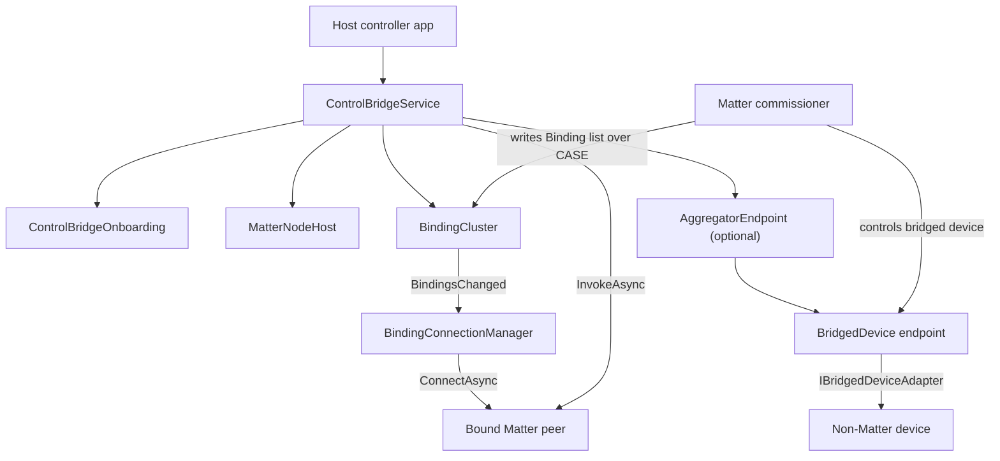
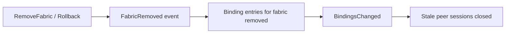

Applies to: `ControlBridge/` and the RIoT2.Orchestrator Matter bridge integration.

# ControlBridge

`RIoT2.Matter.ControlBridge` wraps the core library as a single embeddable service. It can play two
roles on one commissionable Matter node:

- Control Bridge (`0x0840`): outbound controller endpoint. Commissioners write Binding entries, and
  the service opens CASE sessions to bound peers so host code can invoke commands.
- Aggregator (`0x000E`): optional inbound bridge. Host code exposes non-Matter devices as bridged
  endpoints that commissioners read and control as if they were native Matter devices.

## Requirements

- .NET 9 SDK or later. `ImplicitUsings` and `Nullable` are enabled.
- An IPv6-capable network interface. Matter operational traffic uses UDP port `5540`.
- Device attestation credentials (DAC/PAI/CD plus a DAC signer).
- A host-specific persistence plan for commissioned fabrics if the bridge should survive restarts.

QR-code rendering is intentionally left to the consumer. The library returns the `MT:` onboarding
string and the formatted manual pairing code; render or display them in the host.

## Architecture



The Control Bridge role sends commands out to bound Matter peers. The Aggregator role receives
commands from commissioners and mirrors them into non-Matter devices through adapters.

## Main types

| Type | Responsibility |
| --- | --- |
| `ControlBridgeService` | Facade that composes, hosts and drives the bridge |
| `ControlBridgeSettings` | Device identity, attestation, discriminator, discovery and endpoint settings |
| `ControlBridgeOnboarding` | QR string, manual pairing code, passcode and discriminator |
| `ManualPairingCode` | 11-digit manual pairing code encode/format helpers |
| `AggregatorEndpoint` | Optional Aggregator endpoint and dynamic bridged-device registry |
| `BridgedDevice` | One bridged endpoint with reachability and application clusters |
| `BridgedDeviceDefinition` | Application device type, identity facts and cluster composer |
| `IBridgedDeviceAdapter` | Boundary between Matter clusters and the real non-Matter device |
| `IOperationalPeerResolver` | Resolves bound peers to operational IP endpoints |

## Starting a bridge

```csharp
var settings = new ControlBridgeSettings
{
    Information = deviceInformation,
    Attestation = attestation,
    NetworkInterfaces =
    [
        new NetworkInterface { Name = "eth0", IsOperational = true, Type = InterfaceType.Ethernet },
    ],
    Discriminator = 0x0F00,
    ControlEndpoint = new EndpointId(1),
    AggregatorEndpoint = new EndpointId(2),
};

await using var service = ControlBridgeService.Create(settings, resolver);
await service.StartAsync(cancellationToken);

Console.WriteLine(service.Onboarding.QrCode);
Console.WriteLine(service.Onboarding.FormattedManualCode);
```

`ControlBridgeService.Create(settings)` without a resolver still starts and tracks Binding entries,
but it reports every peer as unresolvable and opens no outbound sessions. Supply an
`IOperationalPeerResolver` for real outbound control.

`ControlBridgeService` implements `IAsyncDisposable`; disposing it closes connection managers, stops
the host and unhooks lifecycle handlers in the correct order.

## Onboarding codes

The onboarding artifacts are derived from the same `PaseProvisioning` bundle that installs the
device's SPAKE2+ verifier, so the passcode a user scans and the on-device verifier cannot diverge.

```csharp
ControlBridgeOnboarding onboarding = service.Onboarding;

string qr = onboarding.QrCode;                   // "MT:Y.K90..."
string manual = onboarding.ManualCode;           // "34970112332"
string grouped = onboarding.FormattedManualCode; // "3497-011-2332"
ushort discriminator = onboarding.Discriminator; // 0x0F00
```

You can also generate codes before starting the host, for example for manufacturing labels:

```csharp
using RIoT2.Matter.SecureChannel.Pase;

PaseProvisioning provisioning = PaseVerifierGenerator.Provision();
ControlBridgeOnboarding onboarding = ControlBridgeOnboarding.Create(settings, provisioning);

var pinned = settings with { Provisioning = provisioning };
await using var service = ControlBridgeService.Create(pinned);
```

`settings.Provisioning` pins only the setup passcode/verifier. It does not persist commissioned
fabric credentials; persist `service.Device.Commissioning.Manager` separately when needed.

## Driving bound targets

A commissioner writes the bridge's Binding list over CASE. The library then asks the configured
`IOperationalPeerResolver` for each peer's operational IP endpoint and opens a CASE session.

```csharp
using RIoT2.Matter.Clusters;
using RIoT2.Matter.DataModel;
using RIoT2.Matter.Hosting;

var peer = new OperationalPeer(fabricIndex, peerNodeId);

await service.InvokeAsync(
    peer,
    new EndpointId(1),
    OnOffCluster.ClusterId,
    new CommandId(0x02)); // Toggle
```

`InvokeAsync` throws `InvalidOperationException` when no live session exists. Inspect
`ConnectedPeers` or get the raw connection for other interactions:

```csharp
IReadOnlyCollection<OperationalPeer> connected = service.ConnectedPeers;

MatterNodeConnection? connection = service.GetConnection(peer);
if (connection is not null)
{
    // await connection.InvokeAsync(...);
}
```

For a node outside the Binding list, open a one-off operational session directly:

```csharp
MatterNodeConnection connection = await service.ConnectAsync(
    fabricIndex,
    peerNodeId,
    new IPEndPoint(peerAddress, 5540),
    cancellationToken);
```

## Bridging a non-Matter device

```csharp
var bridged = await service.AddBridgedDeviceAsync(
    new BridgedDeviceDefinition
    {
        DeviceType = StandardDeviceTypes.OnOffLight,
        NodeLabel = "Living Room Lamp",
        Information = new BridgedDeviceInformation
        {
            VendorName = "RIoT2",
            ProductName = "Virtual Lamp",
            UniqueId = "lamp-1",
        },
        ComposeApplicationClusters = endpoint => endpoint.AddCluster(new OnOffCluster()),
    },
    adapter,
    preferredEndpointId: new EndpointId(7),
    cancellationToken);
```

Use `preferredEndpointId` when the host has a persisted device-to-endpoint map. If the requested id
is free and above the aggregator endpoint id, it is used. Otherwise the allocator falls back to the
next sequential id.

## Resolving operational peers

The core library has DNS-SD discovery primitives, but ControlBridge does not automatically resolve
bindings. Supply an `IOperationalPeerResolver` through the resolver overload:

```csharp
using System.Net;
using RIoT2.Matter.Hosting;

public sealed class StaticPeerResolver : IOperationalPeerResolver
{
    private readonly IReadOnlyDictionary<OperationalPeer, IPEndPoint> _map;

    public StaticPeerResolver(IReadOnlyDictionary<OperationalPeer, IPEndPoint> map) => _map = map;

    public ValueTask<IPEndPoint?> ResolveAsync(
        OperationalPeer peer,
        CancellationToken cancellationToken = default) =>
        new(_map.TryGetValue(peer, out var endpoint) ? endpoint : null);
}
```

```csharp
var resolver = new StaticPeerResolver(new Dictionary<OperationalPeer, IPEndPoint>
{
    [new OperationalPeer(fabricIndex, peerNodeId)] = new IPEndPoint(peerAddress, 5540),
});

await using var service = ControlBridgeService.Create(settings, resolver);
```

A peer that fails to resolve is retried on the next binding change.

## Lifecycle guarantees

Version `0.1.14` hardened dynamic bridged endpoint lifecycle:

- Attach composes the endpoint off-node and publishes it only after adapter attach succeeds.
- Failed or cancelled attach leaves no registry entry and no `PartsList` entry.
- Cleanup uses a non-cancelled token and disposes composed disposable clusters.
- Detach leaves endpoint and registry state intact until adapter detach succeeds, so failures can be
  retried.
- Lifecycle operations are serialized per aggregator.

Adapters must tolerate partial attachment and repeated cleanup attempts, and must not call back into
the same aggregator's add/remove methods while lifecycle work is active.

## Fabric lifecycle

When a commissioner removes the bridge from a fabric, or a fail-safe rolls back, the library purges
that fabric's Binding entries and closes the sessions those targets held:



## Orchestrator integration

RIoT2.Orchestrator references `RIoT2.Matter` and `RIoT2.Matter.ControlBridge` version `0.1.14`.
It stores bridge configuration and state, exposes `/api/matter/*`, and maps Core
`MatterEndpointTemplate` declarations to bridged endpoints.

Relevant hub contracts:

- [`matterEndpoints` declarations](https://github.com/Revolutionized-IoT2/.github/blob/main/docs/contracts/configuration.md)
- [`/api/matter/*` routes](https://github.com/Revolutionized-IoT2/.github/blob/main/docs/contracts/http-api.md#matter-bridge-apimatter)
- [A7 Finish the Matter integration](https://github.com/Revolutionized-IoT2/.github/blob/main/docs/architecture/target.md#a7-finish-the-matter-integration)

The current A7 remaining work is in the orchestrator: DNS-SD operational peer resolution for outbound
bindings, stable bridged endpoint id checks across node configuration changes, and splitting the
oversized `MatterBridgeService`.
